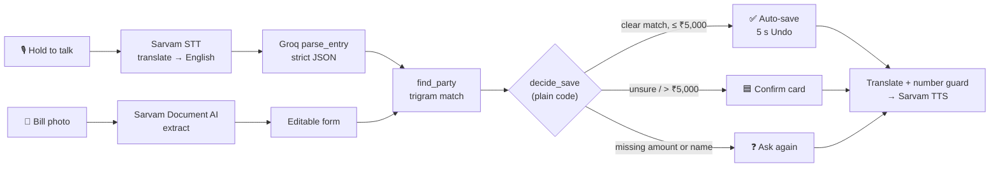

<div align="center">

# 📒 Khata

**Your shop's khata, by voice.**
A voice and receipt ledger for kirana shops, in six Indian languages.

[](https://khata-alpha.vercel.app/demo)
&nbsp;
[](https://khata-alpha.vercel.app/about)
&nbsp;
[](https://khata-alpha.vercel.app)


</div>

---

A shopkeeper holds a button and says *"Ramesh ko 250 udhaar diya"*. Khata writes the entry,
matches the customer, and says it back: *"Ramesh, 250 rupees udhaar, saved."* A supplier bill
can be photographed instead of typed.

## 🚀 Try it in 30 seconds

| | Link | Login |
|---|---|---|
| **Demo mode** (recommended) | **[khata-alpha.vercel.app/demo](https://khata-alpha.vercel.app/demo)** | None. Opens straight into a sample shop |
| **How it works** | [khata-alpha.vercel.app/about](https://khata-alpha.vercel.app/about) | None. A walkthrough of the whole flow |
| **Real account** | [khata-alpha.vercel.app/signup](https://khata-alpha.vercel.app/signup) | Sign up with any email (no confirmation email) |

> [!NOTE]
> **Demo mode** runs entirely in your browser on a sample shop, *Sharma Kirana Store*. Nothing
> is saved, and a reload resets it. Voice and bill reading are **simulated** in the demo; real
> accounts call Sarvam and Groq through the backend. You can also enter from the
> **"Try the demo"** button on the login page. **Exit demo** is in the cyan banner.

### Guided tour of the demo

- [ ] **Ledger.** The sample shop's recent entries and **This week, so far.** Tap **Add by hand** → *Credit given*, ₹300, "Ramesh" → **Save entry**, then **Undo** within 5 seconds.
- [ ] **Hold to add.** Hold the black button for a second and release. Each press adds the next canned voice note:
  - 1st: *Ramesh, ₹250 udhaar*: **auto-saved** with an Undo toast
  - 2nd: *Lakshmi, ₹500 payment received*: auto-saved
  - 3rd: *Suresh, ₹6,000 udhaar*: over ₹5,000, so it waits as **pending** until you tap **Confirm**
  - 4th: *Rakesh, ₹100 udhaar*: close to Ramesh, so it asks **Did you mean Ramesh?**
- [ ] **Hold to ask.** A canned answer: who owes you the most.
- [ ] **Scan a bill.** **Supplier** → **Credit** → pick any JPG/PNG. The vendor, date and total fill in after a moment; **edit the total**, then **Save entry**.
- [ ] **Review.** Pending entries and new people. **Edit** an entry to see its history (old → new).
- [ ] **Parties** and **Settings** (language, voice, invite code). Use the nav: a page reload resets the demo.

<details>
<summary><b>What the real app does differently</b></summary>

| Step | Demo mode | Real account |
|---|---|---|
| Voice | Canned sentences, no microphone upload | Audio → Sarvam `saaras:v3` (translate to English) → Groq `parse_entry` |
| Questions | One canned answer | Groq `gpt-oss-120b` with 5 read-only SQL tools; every number in the answer must come from a tool |
| Read-back | Shown as text | Translated to your language, number-checked, spoken by Sarvam `bulbul:v3` |
| Bill scan | Fixed sample values | Photo → Sarvam Document AI extract in the background (2 s polling, 90 s timeout, English retry) |
| Data | In memory, gone on reload | Supabase Postgres with row-level security per shop, audit log on every change |

</details>

## 🧠 How it works



**The model never decides what gets saved.** `decide_save` is plain code:

| Situation | What happens |
|---|---|
| No amount, no name, or the parser asked a question | Nothing is saved; the question is spoken |
| Name matches a party (score ≥ 0.6, 0.15 ahead of the next) | That party is used |
| Close but uncertain match (0.3–0.6) | "Did you mean X?" card |
| No match at all | The party is created and flagged for review |
| Amount above ₹5,000 | Saved as **pending** until someone taps Confirm |
| Everything else | **Auto-saved**, with a 5-second Undo |

<details>
<summary><b>Ledger rules</b></summary>

- Money is stored as integer **paise**. Balances come only from the `party_balances` SQL view.
- Entry types: `credit_given`, `payment_received`, `cash_sale`, `purchase_credit`, `purchase_paid`, `payment_made`, `expense`.
- Entries are never deleted, only **voided**. A database trigger writes an audit row with before/after for every insert and update.
- Row-level security: a user can only read and write rows for their own shop.
- Bill mapping: supplier + paid → `purchase_paid`, supplier + credit → `purchase_credit`, customer + cash → `cash_sale`, customer + udhaar → `credit_given` (asks for the customer's name), expense → `expense`.
- Dates use **Asia/Kolkata** time.

</details>

## ✅ Status

Checked on branch `goal/complete-khata` (see [REPORT.md](REPORT.md) for evidence and test counts).

| Feature | State |
|---|---|
| Sign up, log in, create or join a shop (invite code), per-user language | ✅ Done |
| Voice entry: hold to talk (30 s cap, 0.7 s minimum), save rules, spoken read-back, 5 s Undo | ✅ Done |
| "Did you mean X?" (YES / NO, NEW PERSON) and clarify questions answered by voice (answers joined with the first recording) | ✅ Done |
| Voice questions ("How much does Ramesh owe?"), answered from SQL through read-only tools, spoken in your language | ✅ Done (numbers are checked against the tool results) |
| Bill scan: kind, Paid/Credit, photo, background reading (2 s polling, 90 s), English retry, editable fields | ✅ Done |
| Bill auto-fill | ✅ Verified live on a printed bill and a phone-style photo (3/3 fields). ⚠️ Real handwritten or faded bills not yet tested. |
| Ledger, add by hand, confirm / void, parties with balances, party detail with the original recording / bill photo | ✅ Done |
| Entry edit with history (who, when, old → new) | ✅ Done |
| Review queue (pending entries, new people: rename / merge / keep, unreadable bills) | ✅ Done |
| Weekly summary ("This week, so far."), cached 15 min, spoken on tap | ✅ Done |
| Settings: language, voice (with a spoken sample), invite code, log out | ✅ Done |
| Public landing page at `/` | ✅ Done (the optional "Built by" section appears when a photo is added) |
| Offline screen, "Waking the server…", accessibility (axe, keyboard, 48 px targets), reduced motion | ✅ Done |
| Demo mode (`/demo`) | ✅ Done |
| Migration `002_one_live_entry_per_receipt.sql` | ⚠️ Written, not yet applied to the database (see DEPLOY.md) |

## 🗂️ Repo layout

```
frontend/        React + Vite app — screens in src/screens, demo backend in src/lib/demo.ts, e2e/ (Playwright)
backend/         FastAPI — app/routers, app/services/{sarvam,llm_router,receipt_ocr}.py, tests/
schema.sql       Database schema (run once in Supabase)
migrations/      SQL to run after schema.sql
scripts/         seed_demo.py (sample data), verify_db.sql (read-only DB checks)
DEPLOY.md        Ordered deploy checklist  ·  DEMO.md  3-minute demo script
docs/            Checked notes on the Sarvam and Groq APIs
CLAUDE.md        Product and build spec  ·  DESIGN.md  Visual spec
render.yaml      Render blueprint for the backend
```

## 💻 Run locally

<details>
<summary><b>1. Database (Supabase)</b></summary>

1. Run `schema.sql`, then each file in `migrations/` in order (`001_…`, `002_…`), in the Supabase SQL editor. `scripts/verify_db.sql` checks the result.
2. Under **Auth → Providers**, enable Email and turn **Confirm email** off.
3. Under **Storage**, create two **private** buckets: `voice` and `receipts`.

</details>

<details>
<summary><b>2. Backend (FastAPI)</b></summary>

```bash
cd backend
python3.12 -m venv .venv
.venv/bin/pip install -r requirements.txt
cp .env.example .env            # fill in Supabase, Sarvam and Groq keys
.venv/bin/uvicorn app.main:app --reload --port 8000
curl localhost:8000/health      # → {"ok":true}
```

Tests: `.venv/bin/pytest -q` (about 210 tests, 10–15 minutes). Sarvam and Groq are always faked
in tests; the database tests use the live Supabase project in `.env`, creating throwaway users
through the admin API and deleting them (and their shops, audit rows and files) afterwards.

</details>

<details>
<summary><b>3. Frontend (Vite)</b></summary>

```bash
cd frontend
npm install
cp .env.example .env.local      # Supabase URL + publishable key, VITE_API_URL=http://localhost:8000
npm run dev                     # → http://localhost:5173  (demo: http://localhost:5173/demo)
```

Checks: `npm run build && npm run lint && npm run typecheck` (`typecheck` covers `src/` and the e2e tests;
the root `tsconfig.json` only lists project references, so a bare `npx tsc --noEmit` there checks nothing).
End-to-end tests (no backend needed; the API and Supabase Auth are mocked):
`npx playwright install chromium` once, then `npm run test:e2e`.

</details>

<details>
<summary><b>4. Sample data for a real shop (optional)</b></summary>

```bash
backend/.venv/bin/python scripts/seed_demo.py you@example.com
```
Adds 6 parties and 15 entries to that user's shop.

</details>

## ☁️ Deploy

<details>
<summary><b>Backend → Render</b></summary>

1. In Render: **New → Blueprint** → pick this repo. It reads `render.yaml`.
2. Set these secrets in the dashboard: `SARVAM_API_KEY`, `GROQ_API_KEY`, `SUPABASE_URL`,
   `SUPABASE_PUBLISHABLE_KEY`, `SUPABASE_SECRET_KEY`, and
   `ALLOWED_ORIGINS=https://khata-alpha.vercel.app,http://localhost:5173`.
3. Check `https://<your-service>.onrender.com/health`.

</details>

<details>
<summary><b>Frontend → Vercel</b></summary>

1. Set the project root to `frontend/`.
2. Add these env vars: `VITE_SUPABASE_URL`, `VITE_SUPABASE_PUBLISHABLE_KEY`, and `VITE_API_URL` (the Render URL).
3. `vercel --prod`. `frontend/vercel.json` sends every path to the app, so links like `/demo` and `/app/scan` work.

</details>

> [!IMPORTANT]
> The Supabase **secret** key stays on the backend. The frontend only gets the publishable key.

## ⚠️ Known limits

- Render's free tier sleeps when idle, so the first real request after a pause is slow (the app says "Waking the server…"). Open the app a minute before a demo. Demo mode doesn't need the backend.
- Audio and bill photos are kept forever as evidence, so Supabase free-tier storage will eventually fill up.
- OCR accuracy on handwritten or faded thermal bills is untested (printed bills: 3/3 fields in live checks).
- The name-match thresholds (0.6 / 0.15 / 0.3) are starting guesses, not yet tuned on real names.
- Out of scope: payment reminders, WhatsApp, offline mode, line items, inventory, GST.
